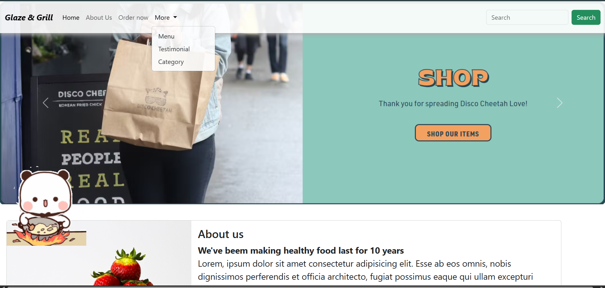
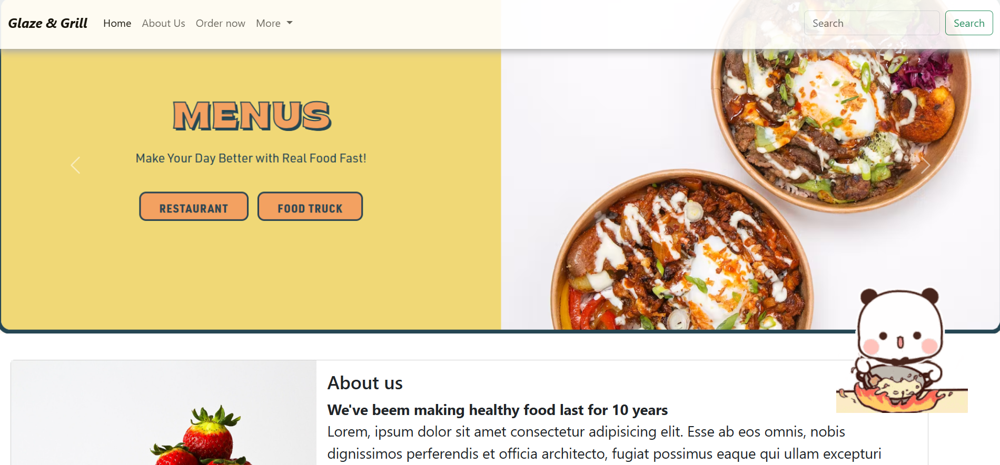

# 🍽️ Glaze & Grill - The Ultimate Restaurant Experience! 🍴

Welcome to **Glaze & Grill**, a stunning, fully-responsive restaurant website that brings your food experience online! 🚀 From mouth-watering menus to glowing testimonials, this site has everything to leave a lasting impression. Built with **HTML**, **CSS**, and **Bootstrap 5**, it’s a treat for both the eyes and the appetite. 🤩

---

## 🔥 Features

* **Responsive & Modern Design** – Looks amazing on phones, tablets, and desktops! 📱💻
* **Interactive Menu** – Browse delicious categories, each with images and prices. 🍕🍣
* **Customer Love** – Real testimonials from happy customers. 💬
* **Instant Search** – Find your favorite dish in seconds. 🔍

---

## 🛠️ Technologies Used

* **HTML5** – Clean and semantic structure 🏗️
* **CSS3** – Stylish and appetizing design 🍒
* **Bootstrap 5** – Sleek, mobile-first layout 💪
* **JavaScript** – For interactivity and smooth experience 🎉

---

## 📸 Preview

> ✨ **See It in Action!** Here's a look at the website in action:

*Beautiful homepage layout with hero section and menu highlight*

*Beautiful homepage layout with hero section and menu highlight*

---

## 📄 License

This project is open-source for **learning and portfolio use** 🎓. Feel free to explore, customize, and make it your own!

---

## 🚀 Want to Use It?

Fork the repo, customize it with your own content, and make your restaurant shine online! 🌐

---
